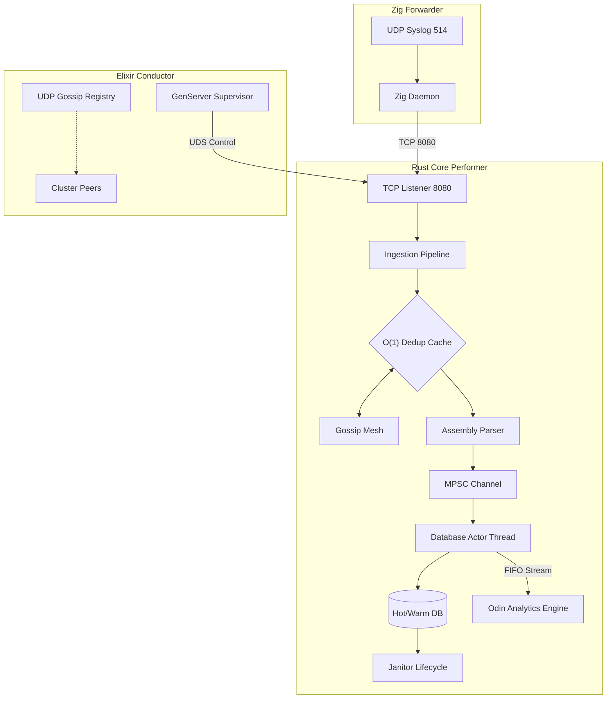

# SIEM: Lightweight, High-Velocity Log Management

## Why this SIEM?

I built this custom, hyper-optimized SIEM because I am deeply frustrated with the bloat, complexity, and exorbitant costs of enterprise solutions like Elastic and Splunk. 

I needed a system that is:
*   **Lean:** Minimal resource footprint with zero-allocation paths.
*   **Fast:** O(1) deduplication and high-throughput ingestion.
*   **Fault-Tolerant:** Embraces the "Let it Fail" philosophy via supervised process management.
*   **Self-Contained:** No massive distributed cluster required for basic operations.

## The Ensemble Orchestra

This SIEM utilizes a "Conductor/Performer" architecture to separate high-velocity data processing from control-plane orchestration:

*   **The Performers (Rust, Zig, Odin, ASM):** These are the high-velocity "musicians." They operate asynchronously and independently, handling log ingestion, assembly-accelerated parsing, and in-memory threat correlation. They synchronize state (deduplication filters) via a P2P Gossip Mesh to avoid centralized bottlenecks.
*   **The Conductor (Elixir/BEAM):** This is the "scorekeeper." It monitors the health of all Performer nodes, handles process supervision (automatically restarting failed performers), propagates global configuration changes (rules/thresholds), and aggregates cluster-wide telemetry.

This hybrid approach leverages Erlang/BEAM’s world-class fault tolerance to manage the lifecycle of high-performance native-compiled data plane components.

## Architecture Highlights

This is a polyglot, ensemble-based architecture designed for extreme performance and fault-tolerance:

*   **Ingestion Pipeline (Rust):** Asynchronous TCP ingestion decoupled by an MPSC channel, featuring a **direct-mapped O(1) deduplication cache** using bitwise masking.
*   **Control Plane (Elixir):** A robust **GenServer-based supervisor** that monitors the Rust core, providing fault-tolerance, automated restarts, and dynamic control interfaces via Unix Domain Sockets (UDS).
*   **Global Ensemble Mesh:** All SIEM nodes form a **Gossip Mesh** using hash-based synchronization, ensuring deduplication events are propagated across the cluster globally.
*   **Optimized Parser:** Zero-heap parsing utilizing `nom` and `CompactString` for stack-allocated storage.
*   **Assembly Acceleration:** FNV-1a deduplication and ISO-8601 parsing implemented in standalone **x86_64/AArch64 assembly** for SIMD-ready performance.
*   **Actor-Based Storage:** Dedicated `database_actor` running in a synchronous OS thread to eliminate lock contention on the SQLite backend.
*   **Threat Correlation Engine (Odin):** High-performance analytics module implemented in **Odin** using `#soa` layouts for vectorized, cache-line optimized security correlation.
*   **Automated Storage Tiering:** 
    *   **Hot Tier:** WAL-indexed SQLite.
    *   **Warm Tier:** Optimized SQLite for historical query.
    *   **Cold Tier:** Automated export to compressed storage.
*   **Janitor:** Background maintenance tasks that handle data migration without blocking ingestion.
*   **Edge Agent (Zig):** High-performance, zero-allocation UDP-to-TCP forwarder implemented in **Zig**.

## License

This project is licensed under the [MIT License](LICENSE).
